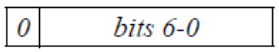
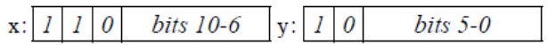
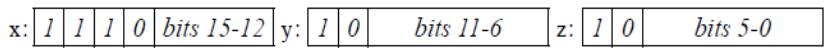
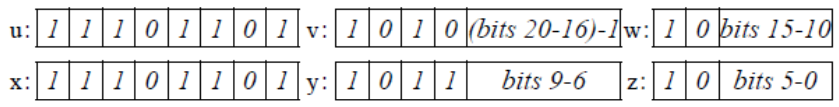

# CONSTANT_Utf8_info 结构 

CONSTANT_Utf8_info 结构用于表示字符串常量的值：

```
CONSTANT_Utf8_info {

u1 tag;

u2 length;

u1 bytes[length];

}
```

CONSTANT_Utf8_info 结构各项的说明如下：

* tag

  CONSTANT_Utf8_info 结构的 tag 项的值为 CONSTANT_Utf8（ 1）。

* length

  length 项的值指明了 bytes[]数组的长度（ 注意，不能等同于当前结构所表示的String 对象的长度），CONSTANT_Utf8_info 结构中的内容是以 length 属性确定长度而不是以 null 作为字符串的终结符。

* bytes[]

  bytes[]是表示字符串值的byte数组，bytes[]数组中每个成员的byte值都不会是0，也不在 0xf0 至 0xff 范围内。

字符串常量采用改进过的 UTF-8 编码表示。 这种以改进过的 UTF-8 编码中，用于表示的字符串的码点字符序列可以包含 ASCII 中的所有非空（ Non-Null）字符和所有 Unicode 编码的字符，一个字符占一个 byte。
码点在范围'\u0001'至'\u007F'内的字符用一个单字节表示：


byte 的后 7 位数据表示一个码点值。
字符为'\u0000'（表示字符'null'），或者在范围'\u0080'至'\u07FF'的字符用一对字节 x 和 y 表示： 



x 和 y 计算字符值的公式为：

```
((x & 0x1f) << 6) +(y & 0x3f)
```

在范围'\u0800'至'\uFFFF'中的字符用 3 个字节 x， y 和 z 表示： 



x， y 和 z 计算字符值的公式为：


```
((x & 0xf) << 12) + ((y & 0x3f) << 6) + (z & 0x3f)
```


超过 U+FFFF 范围的字符（ 称为补充字符， Supplementary Characters），在 UTF-16编码中也需要 2 个 UTF-16 字符单元来表示，而 UTF-16 中的每个字符单元占 3 个字节，这就意味着在我们的编码方式中， 补充字符需要 6 个字节来表示， u， v， w， x， y 和 z：

 

这 6 个字符计算字符值的公式为：


```
0x10000+((v&0x0f)<<16)+((w&0x3f)<<10)+(y&0x0f)<<6)+(z&0x3f)
```


在 Class 文件中，多字节字符按照 Big-Endian 顺序存储。
和“标准”版 UTF-8 格式相比， Java 虚拟机采用的改进版 UTF-8 格式有两点不同。第一，“ null” 字符（ (char) 0）用双字节格式编码表示而不是单字节，所以，改进版 UTF-8 格式不会直接出现 null 值。第二，改进版的 UTF-8 只使用标准版 UTF-8 中的单字节、双字节和三字节格式。 Java 虚拟机不能识别标准版 UTF-8 格式定义 4 字节格式，而是使用自定义的二次三字节（ Two-Times-Three-Byte）格式来代替。
更多关于标准版 UTF-8 格式的内容可以参考《 The Unicode Standard》（版本 6.0.0）的第 3.9 章节“ Unicode Encoding Forms”。 


