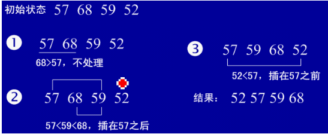

# Java 直接插入排序
* 基本思想：在要排序的一组数中，假设前面(n-1)[n>=2] 个数已经是排好顺序的，现在要把第n个数插到前面的有序数中，使得这n个数也是排好顺序的。如此反复循环，直到全部排好顺序。


* 过程分析



* 用java实现

```java
 package com.njue;  

public class insertSort {  
public insertSort(){  
    inta[]={49,38,65,97,76,13,27,49,78,34,12,64,5,4,62,99,98,54,56,17,18,23,34,15,35,25,53,51};  
    int temp=0;  
    for(int i=1;i<a.length;i++){  
       int j=i-1;  
       temp=a[i];  
       for(;j>=0&&temp<a[j];j--){  
       a[j+1]=a[j];                       //将大于temp的值整体后移一个单位  
       }  
       a[j+1]=temp;  
    }  
    for(int i=0;i<a.length;i++)  
       System.out.println(a[i]);  
}  
}
```