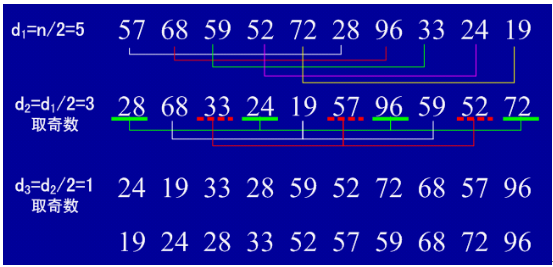

# Java 希尔排序
* 基本思想：算法先将要排序的一组数按某个增量d（n/2,n为要排序数的个数）分成若干组，每组中记录的下标相差d.对每组中全部元素进行直接插入排序，然后再用一个较小的增量（d/2）对它进行分组，在每组中再进行直接插入排序。当增量减到1时，进行直接插入排序后，排序完成。
* 过程分析：

****

* 用java实现

```java
public class shellSort {  
public  shellSort(){  
    int a[]={1,54,6,3,78,34,12,45,56,100};  
    double d1=a.length;  
    int temp=0;  
    while(true){  
        d1= Math.ceil(d1/2);  
        int d=(int) d1;  
        for(int x=0;x<d;x++){  
            for(int i=x+d;i<a.length;i+=d){  
                int j=i-d;  
                temp=a[i];  
                for(;j>=0&&temp<a[j];j-=d){  
                a[j+d]=a[j];  
                }  
                a[j+d]=temp;  
            }  
        }  
        if(d==1)  
            break;  
    }  
    for(int i=0;i<a.length;i++)  
        System.out.println(a[i]);  
}  
}
```

